# Домашнее задание к занятию «Введение в Terraform»

### Цели задания

1. Установить и настроить Terrafrom.
2. Научиться использовать готовый код.

------

### Чек-лист готовности к домашнему заданию

1. Скачайте и установите **Terraform** версии >=1.8.4 . Приложите скриншот вывода команды ```terraform --version```.
2. Скачайте на свой ПК этот git-репозиторий. Исходный код для выполнения задания расположен в директории **01/src**.
3. Убедитесь, что в вашей ОС установлен docker.

#### Ответ 1-3

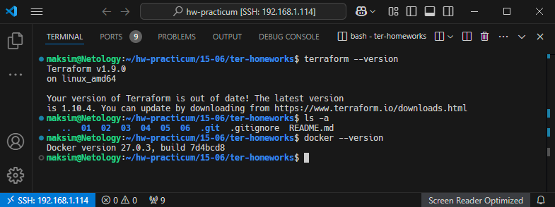

------

### Инструменты и дополнительные материалы, которые пригодятся для выполнения задания

1. Репозиторий с ссылкой на зеркало для установки и настройки Terraform: [ссылка](https://github.com/netology-code/devops-materials).
2. Установка docker: [ссылка](https://docs.docker.com/engine/install/ubuntu/). 
------
### Внимание!! Обязательно предоставляем на проверку получившийся код в виде ссылки на ваш github-репозиторий!
------

### Задание 1

1. Перейдите в каталог [**src**](https://github.com/netology-code/ter-homeworks/tree/main/01/src). Скачайте все необходимые зависимости, использованные в проекте. 

* Ответ

  ```bash
  terraform init
  ```

  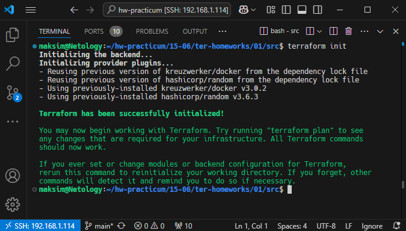

2. Изучите файл **.gitignore**. В каком terraform-файле, согласно этому .gitignore, допустимо сохранить личную, секретную информацию?(логины,пароли,ключи,токены итд)

* Ответ

  Для хранения личной информации следует использовать файл personal.auto.tfvars, т.к. он добавлен в .gitignore. Все файлы заканчивающиеся на *.auto.tfvars — то же, что и terraform.tfvars, позволяет именовать файлы с переменными (в том числе секретными).

3. Выполните код проекта. Найдите  в state-файле секретное содержимое созданного ресурса **random_password**, пришлите в качестве ответа конкретный ключ и его значение.

* Ответ

  ```bash
  "result": "I275ayP8XE9QQDTR"
  ```

  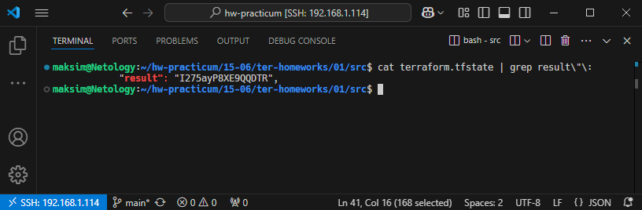

4. Раскомментируйте блок кода, примерно расположенный на строчках 29–42 файла **main.tf**.
Выполните команду ```terraform validate```. Объясните, в чём заключаются намеренно допущенные ошибки. Исправьте их.

* Ответ

  1. Отсутствует уникальное имя для ресурса "docker_image".
  2. Русурсу "docker_container" указали неверное имя, т.к. по правилам не должно начинаться с цифры.
  3. Опечатки: Неверно обратились к имени ресурса "random_password" и к его параметру "result".
  
  Исправлено:
  ```bash
  1. resource "docker_image" "nginx_image_test" {
  2. resource "docker_container" "nginx_container_test" {
  3. name  = "example_${random_password.random_string.result}"
  ```

  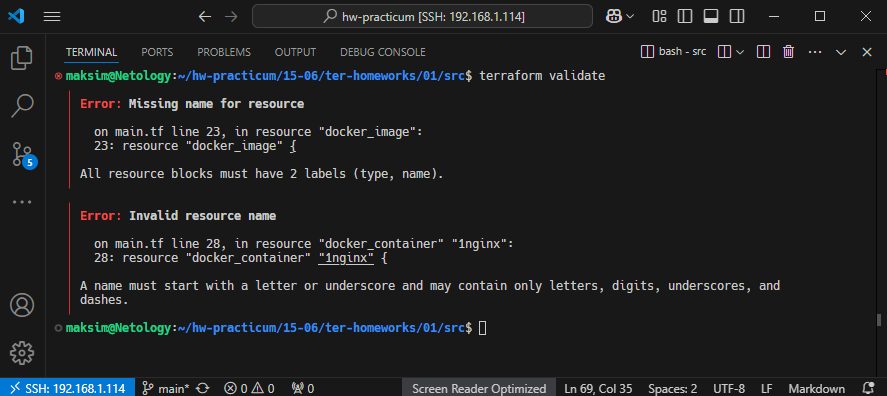

5. Выполните код. В качестве ответа приложите: исправленный фрагмент кода и вывод команды ```docker ps```.

* Ответ

  исправленный фрагмент кода:

  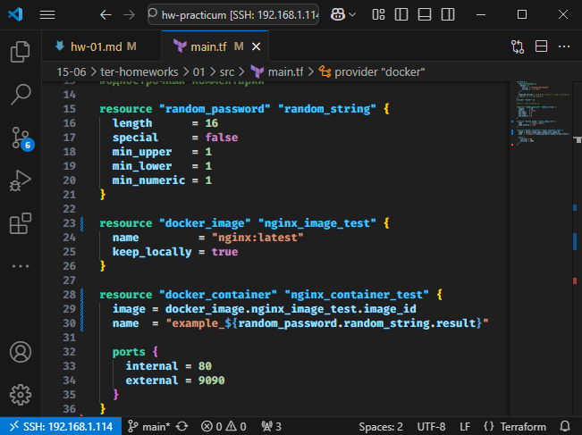

  вывод команды ```docker ps```:

  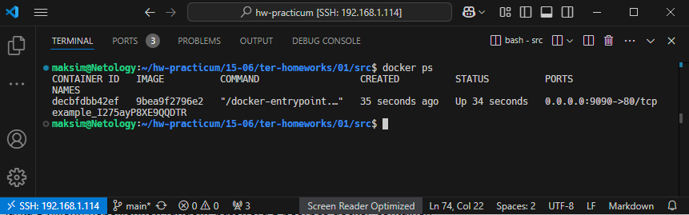

6. Замените имя docker-контейнера в блоке кода на ```hello_world```. Не перепутайте имя контейнера и имя образа. Мы всё ещё продолжаем использовать name = "nginx:latest". Выполните команду ```terraform apply -auto-approve```.
Объясните своими словами, в чём может быть опасность применения ключа  ```-auto-approve```. Догадайтесь или нагуглите зачем может пригодиться данный ключ? В качестве ответа дополнительно приложите вывод команды ```docker ps```.

* Ответ

  Опасность применения ключа ```-auto-approve``` в том, что мы не видим план изменений, и выполнение всех изменений произойдёт автоматически, без ручного подтверждения `yes`. Можно случайно удалить/пересоздать ресурсы, удалить данные, указать неправильное значение.

  ```-auto-approve``` можно использовать в скриптах, в пайплайнах, где вся конфигурация была ранее тщательно проверена и протестирована. 

  вывод команды ```docker ps```:

  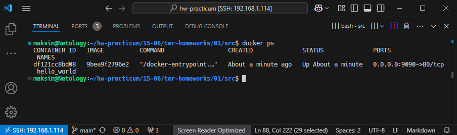

8. Уничтожьте созданные ресурсы с помощью **terraform**. Убедитесь, что все ресурсы удалены. Приложите содержимое файла **terraform.tfstate**. 

* Ответ

  уничтожьте созданные ресурсы с помощью **terraform**:

  ```bash
  terraform destroy
  ```

  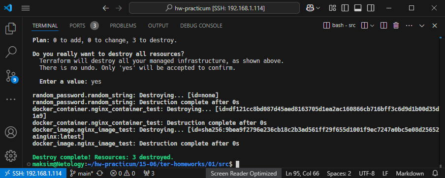

  убедитесь, что все ресурсы удалены:
  
  ```bash
  terraform state list
  ```

  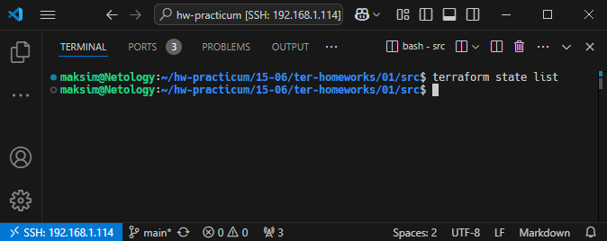

  приложите содержимое файла **terraform.tfstate**:

  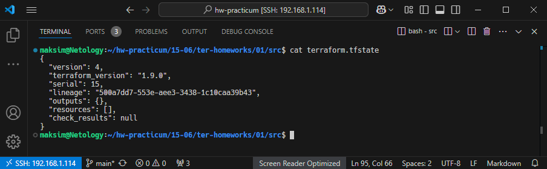

9. Объясните, почему при этом не был удалён docker-образ **nginx:latest**. Ответ **ОБЯЗАТЕЛЬНО НАЙДИТЕ В ПРЕДОСТАВЛЕННОМ КОДЕ**, а затем **ОБЯЗАТЕЛЬНО ПОДКРЕПИТЕ** строчкой из документации [**terraform провайдера docker**](https://docs.comcloud.xyz/providers/kreuzwerker/docker/latest/docs).  (ищите в классификаторе resource docker_image )

* Ответ

  Docker-образ **nginx:latest** не был удалён, т.к. в коде при создании image использовали параметр ```keep_locally = true```:

  ```bash
  resource "docker_image" "nginx_image_test" {
  name         = "nginx:latest"
  keep_locally = true
  ```

  [строчка из документации](https://docs.comcloud.xyz/providers/kreuzwerker/docker/latest/docs/resources/image#keep_locally-1):

  keep_locally (Логическое значение) Если значение равно true, то образ Docker не будет удалён при операции уничтожения. Если значение равно false, то при операции уничтожения образ будет удалён из локального хранилища Docker.

------

## Дополнительное задание (со звёздочкой*)

**Настоятельно рекомендуем выполнять все задания со звёздочкой.** Они помогут глубже разобраться в материале.   
Задания со звёздочкой дополнительные, не обязательные к выполнению и никак не повлияют на получение вами зачёта по этому домашнему заданию. 

### Задание 2*

1. Создайте в облаке ВМ. Сделайте это через web-консоль, чтобы не слить по незнанию токен от облака в github(это тема следующей лекции). Если хотите - попробуйте сделать это через terraform, прочитав документацию yandex cloud. Используйте файл ```personal.auto.tfvars``` и гитигнор или иной, безопасный способ передачи токена!

* Ответ

  Создал ВМ через terraform. Использовал инструкцию: https://yandex.cloud/ru/docs/tutorials/infrastructure-management/terraform-quickstart. Добавил в .gitignore файл meta.txt. Добавил аутентификационные данные в переменные окружения:

  ```bash
  export YC_TOKEN=$(yc iam create-token)
  export YC_CLOUD_ID=$(yc config get cloud-id)
  export YC_FOLDER_ID=$(yc config get folder-id)
  ```
  Код: [src-2/main.tf](src-2/main.tf)

  ```bash
  terraform apply
  ```

  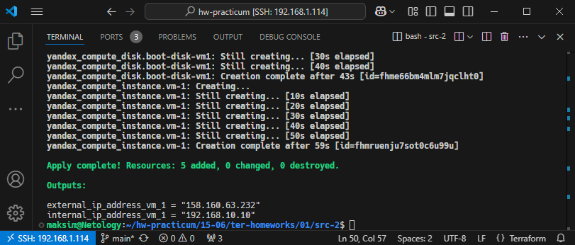

  Yandex Cloud ВМ `fhmruenju7sot0c6u99u`

  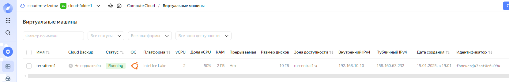

2. Подключитесь к ВМ по ssh и установите стек docker.

* Ответ

  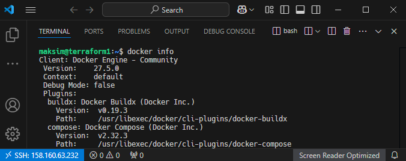

3. Найдите в документации docker provider способ настроить подключение terraform на вашей рабочей станции к remote docker context вашей ВМ через ssh.

* Ответ

  https://docs.comcloud.xyz/providers/kreuzwerker/docker/latest/docs#remote-hosts

  ```bash
  provider "docker" {
  host     = "ssh://user@remote-host:22"
  ssh_opts = ["-o", "StrictHostKeyChecking=no", "-o", "UserKnownHostsFile=/dev/null"]
  }

  # * StrictHostKeyChecking=no — отключает проверку ключа хоста (удобно для автоматизации, но снижает безопасность).
  # * UserKnownHostsFile=/dev/null — игнорирует запись SSH-ключа в файл known_hosts.
  ```

4. Используя terraform и  remote docker context, скачайте и запустите на вашей ВМ контейнер ```mysql:8``` на порту ```127.0.0.1:3306```, передайте ENV-переменные. Сгенерируйте разные пароли через random_password и передайте их в контейнер, используя интерполяцию из примера с nginx.(```name  = "example_${random_password.random_string.result}"```  , двойные кавычки и фигурные скобки обязательны!) 
    ```
    environment:
      - "MYSQL_ROOT_PASSWORD=${...}"
      - MYSQL_DATABASE=wordpress
      - MYSQL_USER=wordpress
      - "MYSQL_PASSWORD=${...}"
      - MYSQL_ROOT_HOST="%"
    ```

* Ответ

  Финальный код: [src-3/main.tf](src-3/main.tf)

  ```bash
  terraform apply
  ```

  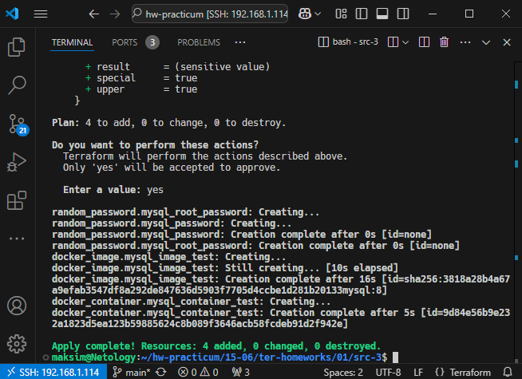


6. Зайдите на вашу ВМ , подключитесь к контейнеру и проверьте наличие секретных env-переменных с помощью команды ```env```. Запишите ваш финальный код в репозиторий.

* Ответ

  ```bash
  docker exec -it mysql env
  ```

  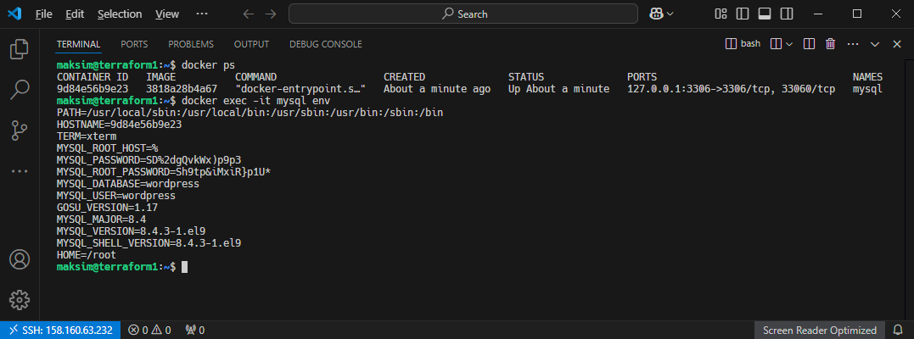

  Финальный код: [src-3/main.tf](src-3/main.tf)

### Задание 3*
1. Установите [opentofu](https://opentofu.org/)(fork terraform с лицензией Mozilla Public License, version 2.0) любой версии
2. Попробуйте выполнить тот же код с помощью ```tofu apply```, а не terraform apply.

* Ответ

  --

------

### Правила приёма работы

Домашняя работа оформляется в отдельном GitHub-репозитории в файле README.md.   
Выполненное домашнее задание пришлите ссылкой на .md-файл в вашем репозитории.

### Критерии оценки

Зачёт ставится, если:

* выполнены все задания,
* ответы даны в развёрнутой форме,
* приложены соответствующие скриншоты и файлы проекта,
* в выполненных заданиях нет противоречий и нарушения логики.

На доработку работу отправят, если:

* задание выполнено частично или не выполнено вообще,
* в логике выполнения заданий есть противоречия и существенные недостатки. 

